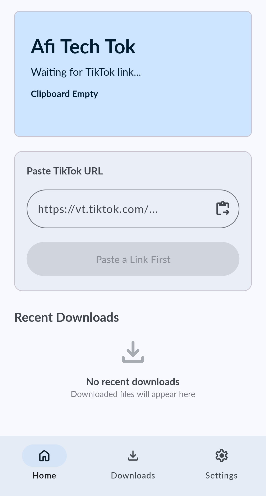
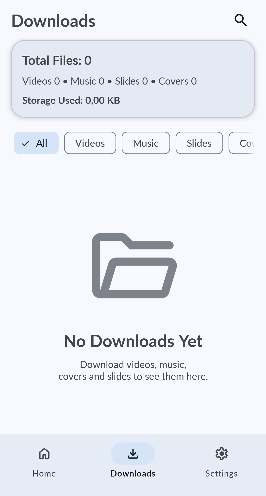
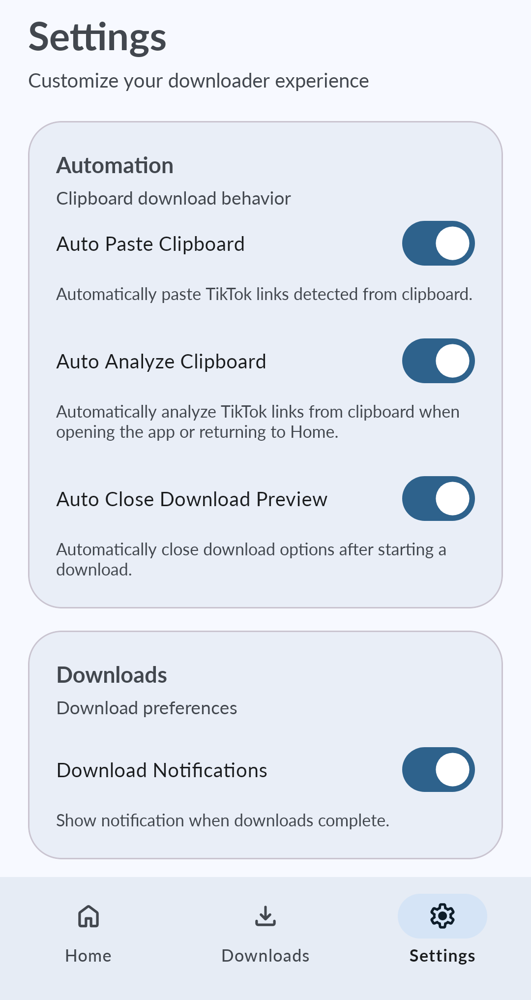

# Afitech

<p align="center">
  
</p>

<h3 align="center">
Afitech
</h3>

<p align="center">
Fast • Modern • No Watermark TikTok Downloader
</p>

<p align="center">
  
  
  
  
</p>

---

## 📱 About

Afitech is a modern Android application designed to download TikTok content quickly and easily.

The application supports downloading:

* 🎥 HD Videos
* 🎵 Music / Audio
* 🖼 Cover Images
* 📸 Slide Photos

Built with modern Android development practices using Kotlin, MVVM Architecture, Material 3 Design, Room Database, and DownloadManager.

---

## ✨ Features

### TikTok Downloader

* Download TikTok videos without watermark
* Download original audio/music
* Download cover images
* Download slide/photo posts
* Smart URL analysis
* Automatic short-link resolution

### Smart Clipboard

* Auto Paste TikTok URL
* Auto Analyze Clipboard
* Clipboard monitoring
* Link detection status

### Download Manager

* Download progress tracking
* Multiple simultaneous downloads
* Download history
* File sharing
* File preview
* Swipe-to-delete support
* Multi-selection actions

### Video Preview

* Built-in ExoPlayer video preview
* Fullscreen playback
* Direct playback from downloaded files

### Modern UI

* Material Design 3
* Dynamic theme support
* Smooth animations
* Responsive layouts
* Bottom Sheet interactions

---

## 📂 Download Structure

Files are saved automatically into:

```text
Download/
└── Afitech/
    ├── Videos/
    ├── Music/
    ├── Covers/
    └── Slides/
```

---

## 🛠 Built With

* Kotlin
* Android SDK
* Material Design 3
* MVVM Architecture
* Room Database
* Coroutines
* Flow
* Glide
* Media3 ExoPlayer
* DownloadManager

---

## 🏗 Architecture

```text
UI Layer
│
├── Fragments
├── Activities
├── BottomSheets
│
ViewModel Layer
│
├── HomeViewModel
├── DownloadsViewModel
│
Repository Layer
│
├── TikTokRepository
├── HistoryRepository
│
Data Layer
│
├── Room Database
├── TikWM API
└── Preferences
```

---

## 🚀 Main Screens

### Home

* Smart clipboard detection
* URL analysis
* Download options
* Recent downloads

### Downloads

* Download history
* Search downloads
* Filters
* Statistics
* Share files
* Delete files

### Settings

* Auto Paste Clipboard
* Auto Analyze Clipboard
* Download Notifications
* Auto Close Download Options

---

## 📸 Screenshots

<p align="center">
  
  
  
</p>

```

---

## 📦 Installation

Clone repository:

```bash
git clone https://github.com/Afihacked/Afitech.git
```

Open project in Android Studio.

Build and run:

```bash
./gradlew assembleDebug
```

---

## 📋 Requirements

* Android 8 (API 27) or higher
* Internet connection
* Storage access permission

---

## ⚠ Disclaimer

This application is intended for personal use only.

Users are responsible for complying with TikTok's Terms of Service and applicable copyright laws.

---

## 👨‍💻 Developer

**Afi Tech**

GitHub:
https://github.com/Afihacked

---

## ⭐ Support

If you like this project:

* Star this repository
* Report bugs
* Suggest new features
* Share with friends

---

<p align="center">
Made with ❤️ by Afi Tech
</p>
